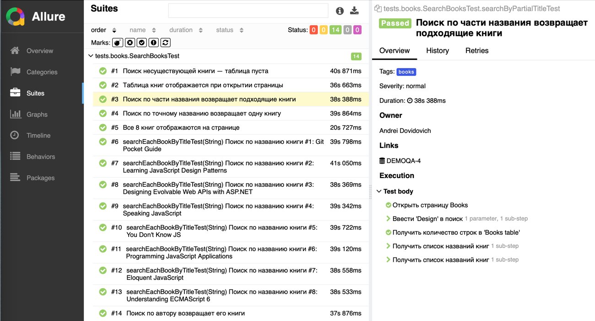

# UI Automation Project (Selenium + JUnit 5)

[](https://github.com/AndreiDovidovich/selenium-junit-project/actions/workflows/ci.yml)


UI-автотесты для [demoqa.com](https://demoqa.com) на Selenium + JUnit 5 + Allure.
Проект демонстрирует Page Object Model, Element Object, Allure-отчётность и GitHub Actions CI.

## Стек

| Технология | Версия | Назначение |
|------------|--------|------------|
| Java | 21 | Язык |
| Selenium WebDriver | 4.x | Автоматизация браузера |
| JUnit 5 | 5.11 | Test runner |
| Maven | 3.9+ | Сборка |
| Allure Report | 2.29 | Отчётность |
| WebDriverManager | 5.9 | Управление драйверами |
| Log4j2 | 2.24 | Логирование |

## Покрытие

| Раздел | Тесты |
|--------|-------|
| **Login** | неверный пароль, неверный username |
| **Book Store — Search** | поиск по названию, по автору, по части названия, негативный поиск, data-driven |

## Архитектура

```
src/main/java/
├── elements/         # Обёртки над WebElement (InputElement, ButtonElement, TableElement, ...)
├── pages/            # Page Object — структура страниц
└── utils/            # LoadPropertiesUtils

src/test/java/
├── tests/            # Сами тесты
└── resources/        # config.properties, log4j2.xml
```

- **Elements** — типизированные обёртки над Selenium-элементами с логированием и Allure-шагами.
- **Pages** — описывают структуру страницы и бизнес-действия (`login`, `search`).
- **Tests** — только сценарии и проверки.


## Как запустить
```bash
mvn clean test

# Headless (как на CI)
mvn clean test -Dheadless=true

# Только smoke-тесты
mvn clean test -Dgroups=smoke
```

## Отчёт
```bash
mvn allure:serve
```
Откроется браузер с интерактивным отчётом: шаги, вложения, скриншоты упавших тестов, история прогонов.

## Пример Allure отчета


## CI

GitHub Actions запускает тесты на каждый `push` и `pull_request` в `main`,
прогоняет их в headless-режиме и публикует Allure-отчёт на GitHub Pages.

Workflow: [`.github/workflows/ci.yml`](.github/workflows/ci.yml)

## Структура проекта

```
.
├── .github/
│   └── workflows/
│       └── ci.yml                    # GitHub Actions
├── src/
│   ├── main/java/
│   │   ├── elements/                 # Element Object
│   │   ├── pages/                    # Page Object
│   │   └── utils/                    # Утилиты
│   └── test/
│       ├── java/tests/               # Тесты
│       └── resources/
│           ├── config.properties     # Конфиг
│           └── log4j2.xml            # Логирование
├── pom.xml
└── README.md
```
